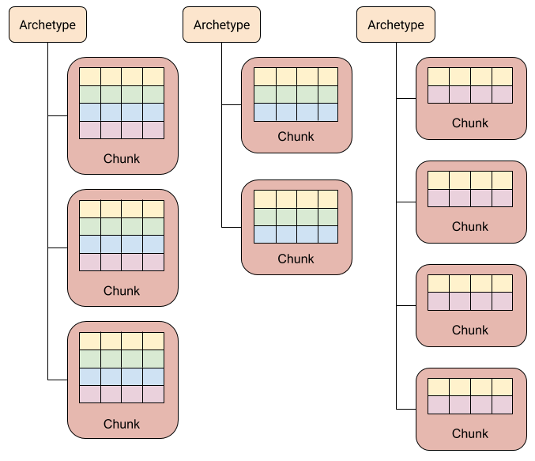

# Components

ECS components should not be confused with classic Unity components. A classic Unity component:

- is an instance of a class
- is contained by a GameObject
- typically includes behavior (methods)
- inherits from `UnityEngine.Component`

An ECS component:

- is usually an instance of a struct (an *unmanaged* component) but can also be an instance of a class (a *managed* component)
- is associated with an entity (or with *multiple* entities, in the case of shared components and chunk components)
- typically does *not* include behavior (methods) 
- implements one of these interfaces: `IComponentData`, `ISharedComponentData`, `ISystemStateComponentData`, `ISystemStateSharedComponentData`, `IBufferElementData`

These interfaces have no methods or properties, but they effectively mark the struct or class as being a type of ECS component.

*(Only the `IComponentData` interface is discussed on this page. For the other interfaces, see the other pages of this manual section.)*

### Unmanaged `IComponentData` components

`IComponentData` marks a struct as an unmanaged component type. These are the most commonly used kinds of components and so could be called 'standard' components.

 The fields of an `IComponentData` struct can only be these types:
    
 * [Blittable types](https://docs.microsoft.com/en-us/dotnet/framework/interop/blittable-and-non-blittable-types)
 * `bool`
 * `char`
 * `BlobAssetReference<T>` (a reference to a Blob data structure)
 * `Collections.FixedString` (a fixed-sized character buffer)
 * `Collections.FixedList`
 * [Fixed array](https://docs.microsoft.com/en-us/dotnet/csharp/language-reference/keywords/fixed-statement) (only allowed in
   an [unsafe](https://docs.microsoft.com/en-us/dotnet/csharp/language-reference/keywords/unsafe) context)
 * Other structs conforming to these same restrictions

### Managed `IComponentData` components

`IComponentData` marks a class as a managed component type. These are used much less commonly than unmanaged components.

The fields of an `IComponentData` class can be of any type, including NativeContainers or any managed types (though they may require special handling for cloning, comparison, and serialization). Unlike unmanaged components, a managed component:

* Cannot be accessed in jobs.
* Cannot be used in Burst compiled code.
* Requires garbage collection.
* Must be default constructible (for serialization purposes).

Because of their performance drawbacks, managed components should be avoided where unmanaged components suffice.

### Archetypes and chunks

An entity's set of component types is known as its *archetype*.

Entities and their components are stored in blocks of memory called *chunks*. A chunk can only store entities of the same archetype.

- Each archetype == zero or more chunks.
- Each chunk == one or more entities (all of the same archetype).

Each chunk is 16KiB in size, divided into parallel arrays: one for each component type, plus an additional array for storing the ids of the entities. The id and components of the chunk's first entity are stored at index 0 of these arrays; the chunk's second entity at index 1; the chunk's third entity at index 2; and so forth.

The user does not have direct control over the creation and destruction of chunks: the API itself manages the chunk storage and puts entities in chunks matching their archetypes. The user simply tells the API when they want to create or destroy entities and add or remove components of the entities.

The number of entities that can be stored in a chunk depends upon the number and sizes of the component types. For example, if components A, B, and C add up to 92 bytes in size, then a single entity of this archetype requires 100 bytes of storage (including the 8 bytes for the entity id). So a chunk of this archetype can store ~163 entities (16384 bytes divided by 100). (The precise count depends upon padding and the size of the chunk header.)

A chunk header includes the current count of entities in the chunk (which may be less than the chunk's capacity). The occupied slots of a chunk's arrays always precede the empty slots, with no gaps interspersed:

- When an entity is added to a chunk, it is placed in the first free slot.
- When an entity is removed from a chunk, the last entity in the chunk is moved to fill the gap.

Adding or removing components of an entity changes it archetype, and so the entity is moved to a different chunk, one that matches its new archetype.

### Tag components

An `IComponentData` struct with no fields is known as a *tag* component. Because tag components have no data, chunks store no component arrays for their tag components. Otherwise, tag components behave like regular unmanaged component types.    

### Unmanaged component storage

Unlike unmanaged components, managed components are *not* stored directly in the chunks. Instead, the managed component class instances are all referenced in one big array for the whole `World`, and a managed type component array in a chunk just stores indexes into this array. So accessing a managed component of an entity requires an extra indexing lookup (which is partly what makes managed components less optimal then unmanaged components).

*(How the other kinds of components are stored is described in their respective manual pages.)*

### Adding and removing components from entities

On the main thread, you can add and remove the components of a `World`'s entities using the `World`'s `EntityManager`. As mentioned above, adding and removing components changes an entity's archetype, necessitating that the entity be moved to a different chunk.

What we call *structural changes* include:

- Creating a chunk.
- Destroying a chunk.
- Adding entities to a chunk.
- Removing entities from a chunk.
- Setting an entity's `ISharedComponentData` value (because it [requires moving the entity to another chunk](https://docs.unity3d.com/Packages/com.unity.entities@latest?subfolder=/manual/shared_component_data.html)).

Simply *setting* an entity's `IComponentData` value, however, is *not* a structural change.

Structural changes can only be performed on the main thread, not from jobs. The workaround for this is to use an [`EntityCommandBuffer`](https://docs.unity3d.com/Packages/com.unity.entities@latest?subfolder=/manual/entity_command_buffer.html) in a job to *record your intention to make changes later*. The [`EntityCommandBuffer`](https://docs.unity3d.com/Packages/com.unity.entities@latest?subfolder=/manual/entity_command_buffer.html) can then be 'played back' later on the main thread to enact the recorded changes.

So while you can't immediately add or remove components in a job, you can use an [`EntityCommandBuffer`](https://docs.unity3d.com/Packages/com.unity.entities@latest?subfolder=/manual/entity_command_buffer.html) to record your intention to add or remove components later.

### Reading and writing component values of entities

Sometimes you just want to read or write a single component of one entity at a time:

- On the main thread, you can ask the `EntityManager` to read or write a component value of an individual entity. (The `EntityManager` keeps a lookup table to quickly find each entity's chunk and index within the chunk.)

For most non-trivial work, though, you want to read or write the components of all entities in a chunk (or set of chunks):

- An `ArchetypeChunk` allows us to directly read and write the component arrays of a chunk.
- An `EntityQuery` efficiently retrieves the set of chunks which match the query.
- An [`Entities.ForEach`](https://docs.unity3d.com/Packages/com.unity.entities@latest?subfolder=/manual/ecs_entities_foreach.html) conveniently handles the creation and use of an `EntityQuery` for us while also making it more convenient to iterate through the entities of the chunk(s), either on the main thread or in a job.

In some cases, you want to defer component value changes for later:

- An [`EntityCommandBuffer`](https://docs.unity3d.com/Packages/com.unity.entities@latest?subfolder=/manual/entity_command_buffer.html) can record your intention to write (but not read) component values. These changes are only then enacted when you later play back the [`EntityCommandBuffer`](https://docs.unity3d.com/Packages/com.unity.entities@latest?subfolder=/manual/entity_command_buffer.html) on the main thread.

### Favor small components
 
 When memory is accessed, it is copied between memory and cache in 64-byte\* units called [cache lines](https://en.wikipedia.org/wiki/CPU_cache#Cache_entries). So when looping through bytes of memory, bytes you ignore still get copied if you access other bytes in the same cache line. Effectively, skipping over bytes wastes [memory bandwidth](https://en.wikipedia.org/wiki/Memory_bandwidth).

Keep in mind then, when you loop through an array of component structs, bytes of fields you ignore may be taking up memory bandwidth. By splitting your components up into more components with fewer fields each, it's less likely that your loops will wastefully ignore one or more component fields, and thus less likely that your code will waste memory bandwidth.  

 In general, splitting data up into many small component types is the best starting strategy. In fact, ***components with one field are often the norm***. However, as your code stabilizes, you may notice that some components are always used together, in which case you might consider consolidating them together.
 
 *\*Cache line size actually varies between platforms. 64 bytes is the most common size today, but some recent hardware has 128-byte cache lines.*

### Avoid putting methods on components

Unlike GameObject components, ECS components are generally intended to have just data, not code, so you should usually put code in methods of systems rather than methods of ECS components. However, it is generally fine to give an ECS component small accessor methods.
