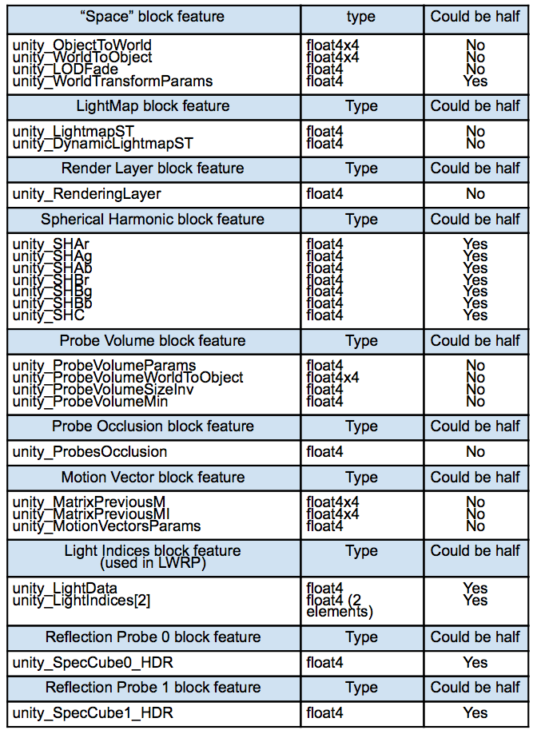

# The BatchRendererGroup API

[BatchRendererGroup](https://docs.unity3d.com/ScriptReference/Rendering.BatchRendererGroup.html) is the Unity Engine API that the Hybrid Renderer uses. If you are using the Hybrid Renderer, you don't need to interact with this API directly; however, if you are an advanced rendering engineer and you want to build your own renderer on top of this API, this section will give you some advice.

Important: This API is experimental and changes frequently. We are adding support for all the remaining URP and HDRP features, and making the data model more efficient to provide AAA class performance. We do not guarantee that the current API will remain stable, and we have a long term plan to rewrite it completely to make it more flexible, efficient, and straightforward to use.

The BatchRendererGroup class actually presents two different versions of the API: one for Hybrid Renderer V1, and one for Hybrid Renderer V2. You cannot mix and match V1 and V2 API calls inside a single BatchRendererGroup instance.

Common APIs:

- [AddBatch](https://docs.unity3d.com/2020.1/Documentation/ScriptReference/Rendering.BatchRendererGroup.AddBatch.html)
- [RemoveBatch](https://docs.unity3d.com/2020.1/Documentation/ScriptReference/Rendering.BatchRendererGroup.RemoveBatch.html)
- [GetNumBatches](https://docs.unity3d.com/2020.1/Documentation/ScriptReference/Rendering.BatchRendererGroup.GetNumBatches.html)
- [SetBatchBounds](https://docs.unity3d.com/2020.1/Documentation/ScriptReference/Rendering.BatchRendererGroup.SetBatchBounds.html)
- [SetBatchFlags](https://docs.unity3d.com/2020.1/Documentation/ScriptReference/Rendering.BatchRendererGroup.SetBatchFlags.html)
- [SetInstancingData(MaterialPropertyBlock)](https://docs.unity3d.com/2020.1/Documentation/ScriptReference/Rendering.BatchRendererGroup.SetInstancingData.html) (not implemented)

Hybrid Renderer V1 APIs:

- [GetBatchMatrices](https://docs.unity3d.com/2020.1/Documentation/ScriptReference/Rendering.BatchRendererGroup.GetBatchMatrices.html)
- [GetBatchMatrixArray](https://docs.unity3d.com/2020.1/Documentation/ScriptReference/Rendering.BatchRendererGroup.GetBatchMatrixArray.html)
- [GetBatchScalarArray](https://docs.unity3d.com/2020.1/Documentation/ScriptReference/Rendering.BatchRendererGroup.GetBatchScalarArray.html)
- [GetBatchScalarArrayInt](https://docs.unity3d.com/2020.1/Documentation/ScriptReference/Rendering.BatchRendererGroup.GetBatchScalarArrayInt.html)
- [GetBatchVectorArray](https://docs.unity3d.com/2020.1/Documentation/ScriptReference/Rendering.BatchRendererGroup.GetBatchVectorArray.html)
- [GetBatchVectorArrayInt](https://docs.unity3d.com/2020.1/Documentation/ScriptReference/Rendering.BatchRendererGroup.GetBatchVectorArrayInt.html)

Hybrid Renderer V2 APIs:

- [SetBatchPropertyMetadata](https://docs.unity3d.com/2020.1/Documentation/ScriptReference/Rendering.BatchRendererGroup.SetBatchPropertyMetadata.html)

## Setting per-instance shader property input data

The SetInstancingData(MaterialPropertyBlock) API has never been implemented. To set per-instance shader property input data, you should use the V1 GetBatch..Array APIs listed above, or the V2 SetBatchPropertyMetadata API.

The GetBatch..Array APIs return a NativeArray<T>. You write per-instance data to these native arrays. The data is persistent, so you don't need to rewrite data that's not changed.

The SetBatchPropertyMetadata API is more complex. You first call[ HybridV2ShaderReflection.GetDOTSInstancingCbuffers](https://docs.unity3d.com/2020.1/Documentation/ScriptReference/Unity.Rendering.HybridV2.HybridV2ShaderReflection.GetDOTSInstancingCbuffers.html), and[ HybridV2ShaderReflection.GetDOTSInstancingProperties](https://docs.unity3d.com/2020.1/Documentation/ScriptReference/Unity.Rendering.HybridV2.HybridV2ShaderReflection.GetDOTSInstancingProperties.html) to find out the data layout that the shader is expecting. Then you fill out an array of constant buffer lengths, and another array containing all constant buffer metadata. Each integer in the metadata array tells the start offset of an shader property array. All properties are sub-allocated in a big compute buffer. You bind a global compute buffer named `unity_DOTSInstanceData` using[ Shader.SetGlobalBuffer](https://docs.unity3d.com/ScriptReference/Shader.SetGlobalBuffer.html), and load all the instance data from this compute buffer.

You are responsible for filling this compute buffer yourself, using the existing Unity APIs or using a custom compute shader. We have some helper classes to make the implementation easier: you can use HeapAllocator to sub-allocate the compute buffer, and you can use SparseUploader to upload sparse data from the CPU to the GPU.

When using the BatchRendererGroup you are responsible for calculating and filling all the `unity_XXX` built-in shader properties. When you call[ HybridV2ShaderReflection.GetDOTSInstancingProperties](https://docs.unity3d.com/2020.1/Documentation/ScriptReference/Unity.Rendering.HybridV2.HybridV2ShaderReflection.GetDOTSInstancingProperties.html) you will get a list of all the properties the shader expects.

Here's a list of all the properties you need to compute:

When implementing your own rendering on top of the BatchRendererGroup API, you also need to implement a culling callback function. This function is called N times each frame after the SRP C# script setups all the viewports. The culling callback function takes the camera and frustum planes as input and is responsible for writing out visible instance indices for each batch.

For more information look at source files HybridV2RenderSystem.cs, HybridV2Culling.cs, SparseUploader.cs and HeapAllocator.cs.