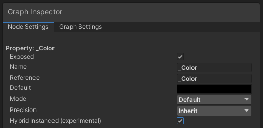

# Using Hybrid Renderer V1

The Hybrid Renderer package contains two versions of Hybrid Renderer. This document contains usage information specific to version one of Hybrid Renderer. For information about the differences between the versions, see [Hybrid Renderer versions](hybrid-renderer-versions.md).

For information on how to install Hybrid Renderer V1, see [Hybrid Renderer V1 in Creating a new Hybrid Renderer Project](creating-a-new-hybrid-renderer-project.md#hybrid-renderer-v1).

## Setting up shaders for Hybrid Renderer V1

Hybrid Renderer V1 only supports Shader Graph based shaders. It does not support built-in shaders such as HDRP/Lit.

Note that Hybrid Renderer V1 requires at least one Hybrid Instanced property in each compatible Shader Graph shader. You don't need to use this property in the shader, but if the Shader Graph does not have at least one, the rendering might be corrupted on some platforms. Hybrid Renderer V2 does not include this restriction.

To make properties Hybrid Instanced, the first step is to enable **Enable GPU Instancing** on every material used with the Hybrid Renderer: 

Next, the method changes depending on the Unity version and render pipeline package version: 

- Unity 2019.1 with HDRP 5.x.x: Enable **DOTS Instancing** in Shader Graph HDRP/Lit master node (cog menu): 
  
- Unity 2019.2 with HDRP 6.x.x: Enable **GPU Instanced** in any Shader Graph custom property: 
  
- Unity 2019.3/2019.4 with HDRP/URP 7.x.x, or Unity 2020.1 with HDRP/URP 8.x.x: Enable **Hybrid Instanced (experimental)** for any Shader Graph custom property: 
  
- Unity 2020.1 with HDRP/URP 9.x.x: Enable **Hybrid Instanced (experimental)** for any Shader Graph custom property. This property is in the **Node Settings** tab of the **Graph Inspector**: 
  
- Unity 2020.2 with HDRP/URP 10.x.x: Set **Shader Declaration** to **Hybrid Per Instance** for any Shader Graph custom property. **Shader Declaration** is in the **Node Settings** tab of the **Graph Inspector**: 
  

Unless every shader and material you use with Hybrid Renderer V1 is set up correctly, you might encounter visual issues. Unfortunately, there's no validation or error messages in Hybrid Renderer V1. The most common visual issues caused by incorrect Shader and Material setup are:

- All entities rendering at position (0,0,0) in standalone builds
- Flickering or incorrect colors, especially on DX12, Vulkan and Metal backends
- Flickering/stretching polygons, especially on DX12, Vulkan and Metal backends

Important: If you are using Hybrid Renderer V1 with URP and an unsupported Unity version, you might see similar graphics issues.